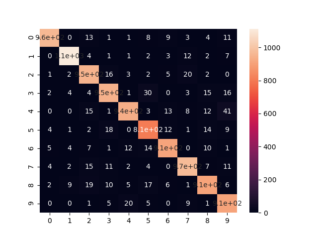
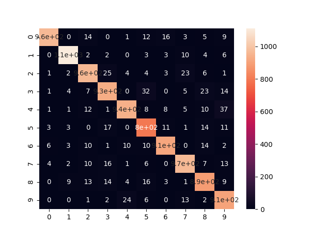
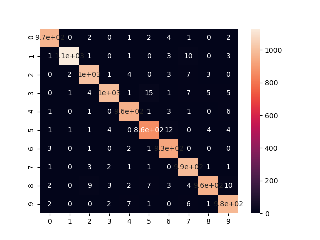
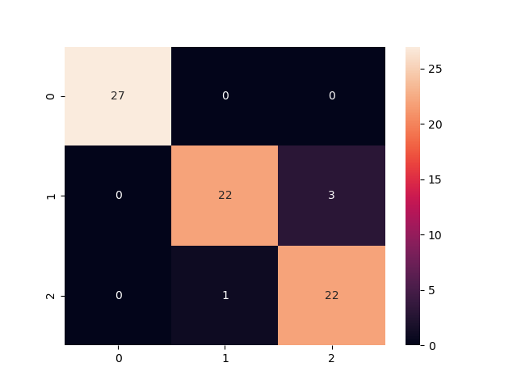

# cs390_lab1
## Author: Rishabh Rajesh
## Email: rajeshr@purdue.edu

## How to use

1. Run ```python lab1.py --dataset {iris/mnist} --model {guesser,custom_net,custom_net_3layer,custom_net_nlayer,tf_net} ```, *Note: guesser will not work with iris dataset.*


## Report:


My custom neural net made heavy use of matrix multiplication using numpy to speed up the 
training process. 

Weight and Bias initialization attempted to normalize it via a gaussian by taking the square root of n. I don't remember where I read it, but I do remember reading that it helps "speed up convergence."

The forward process simply involved applying an activation function to the summed matrix rows which was passed on to each subsequent layer and computed till output.

My backpropagation algorithm has two stages, one for the first backprop iteration and then the rest. For the first one, we take the derivative of the cost function with respect to output, then multiply it by the activation function derivative and multiply that with its previous hidden layer activation. This product is our first delta for output weights, and we store the product and use it "recursively" in the next layer's calculations. 

The backprop algorithm essentially follow these formulas:


## Results:

1. Custom 2 layer Neural Net on mnist (batch_size=64,lr=0.5,epochs=10,hidden_layers=[64])

Heatmap:


Program Text Output:
```
Classifier algorithm: custom_net
Classifier accuracy: 94.020000%
[[ 966    0   10    1    1    7   10    3    6   11]
 [   0 1116    2    0    4    2    3    8    4    8]
 [   1    2  952   20    4    1    5   21    3    1]
 [   2    3    6  929    0   26    1    4   13   13]
 [   0    0   11    1  929    4    5    6   12   38]
 [   3    2    4   27    0  813   14    2   14   11]
 [   5    4   12    3   11   14  918    0    9    1]
 [   2    2   13   13    3    1    0  965    7   11]
 [   1    6   20   14    5   18    2    3  905    6]
 [   0    0    2    2   25    6    0   16    1  909]]
              precision    recall  f1-score   support

           0       0.99      0.95      0.97      1015
           1       0.98      0.97      0.98      1147
           2       0.92      0.94      0.93      1010
           3       0.92      0.93      0.93       997
           4       0.95      0.92      0.93      1006
           5       0.91      0.91      0.91       890
           6       0.96      0.94      0.95       977
           7       0.94      0.95      0.94      1017
           8       0.93      0.92      0.93       980
           9       0.90      0.95      0.92       961

    accuracy                           0.94     10000
   macro avg       0.94      0.94      0.94     10000
weighted avg       0.94      0.94      0.94     10000
```

2. Custom Neural Net 3 layers on mnist [EC +3] (batch_size=64,lr=0.5,epochs=10,hidden_layers=[64, 32])

Heatmap:


Program Text Output:
```
Classifier algorithm: custom_net_3layer
Classifier accuracy: 94.120000%
[[ 962    0   13    1    1    8    9    3    4   11]
 [   0 1113    4    1    1    2    3   12    2    7]
 [   1    2  952   16    3    2    5   20    2    0]
 [   2    4    4  946    1   30    0    3   15   16]
 [   0    0   15    1  937    3   13    8   12   41]
 [   4    1    2   18    0  807   12    1   14    9]
 [   5    4    7    1   12   14  910    0   10    1]
 [   4    2   15   11    2    4    0  971    7   11]
 [   2    9   19   10    5   17    6    1  907    6]
 [   0    0    1    5   20    5    0    9    1  907]]
              precision    recall  f1-score   support

           0       0.98      0.95      0.97      1012
           1       0.98      0.97      0.98      1145
           2       0.92      0.95      0.94      1003
           3       0.94      0.93      0.93      1021
           4       0.95      0.91      0.93      1030
           5       0.90      0.93      0.92       868
           6       0.95      0.94      0.95       964
           7       0.94      0.95      0.95      1027
           8       0.93      0.92      0.93       982
           9       0.90      0.96      0.93       948

    accuracy                           0.94     10000
   macro avg       0.94      0.94      0.94     10000
weighted avg       0.94      0.94      0.94     10000
```

3. Custom Neural Net N-Layer on MNIST [+5 EC] (batch_size=64,lr=0.5,epochs=10,hidden_layers=[128, 64, 32])

Heatmap:


Program Text Output:
```
Classifier algorithm: custom_net_nlayer
Classifier accuracy: 93.800000%
[[ 964    0   14    0    1   12   16    3    5    9]
 [   0 1111    2    2    0    3    3   10    4    6]
 [   1    2  963   25    4    4    3   23    6    1]
 [   1    4    7  932    0   32    0    5   23   14]
 [   1    1   12    1  938    8    8    5   10   37]
 [   3    3    0   17    0  795   11    1   14   11]
 [   6    3   10    1   10   10  914    0   14    2]
 [   4    2   10   16    1    6    0  967    7   13]
 [   0    9   13   14    4   16    3    1  889    9]
 [   0    0    1    2   24    6    0   13    2  907]]
              precision    recall  f1-score   support

           0       0.98      0.94      0.96      1024
           1       0.98      0.97      0.98      1141
           2       0.93      0.93      0.93      1032
           3       0.92      0.92      0.92      1018
           4       0.96      0.92      0.94      1021
           5       0.89      0.93      0.91       855
           6       0.95      0.94      0.95       970
           7       0.94      0.94      0.94      1026
           8       0.91      0.93      0.92       958
           9       0.90      0.95      0.92       955

    accuracy                           0.94     10000
   macro avg       0.94      0.94      0.94     10000
weighted avg       0.94      0.94      0.94     10000
```

4. Keras Neural Network 2 layer on mnist (batch_size=64,lr=0.5,epochs=10,hidden_layers=[64], optimizer='adam', hidden_layer_activation='relu', output_layer_activation='softmax', loss='categorical_cross_entropy')

Heatmap:


Program Text Output:
```
Classifier algorithm: tf_net
Classifier accuracy: 97.940000%
[[ 969    0    2    0    1    2    4    1    0    2]
 [   1 1131    1    0    1    0    3   10    0    3]
 [   0    2 1010    1    4    0    3    7    3    0]
 [   0    1    4  998    1   15    1    7    5    5]
 [   1    0    1    0  963    1    3    1    0    6]
 [   1    1    1    4    0  864   12    0    4    4]
 [   3    0    1    0    2    1  929    0    0    0]
 [   1    0    3    2    1    1    0  992    1    1]
 [   2    0    9    3    2    7    3    4  960   10]
 [   2    0    0    2    7    1    0    6    1  978]]
              precision    recall  f1-score   support

           0       0.99      0.99      0.99       981
           1       1.00      0.98      0.99      1150
           2       0.98      0.98      0.98      1030
           3       0.99      0.96      0.98      1037
           4       0.98      0.99      0.98       976
           5       0.97      0.97      0.97       891
           6       0.97      0.99      0.98       936
           7       0.96      0.99      0.98      1002
           8       0.99      0.96      0.97      1000
           9       0.97      0.98      0.98       997

    accuracy                           0.98     10000
   macro avg       0.98      0.98      0.98     10000
weighted avg       0.98      0.98      0.98     10000
```

5. Custom Neural Net 2 layer on iris dataset [EC +5] (batch_size=2,lr=0.1,epochs=100,hidden_layers=[8])

Heatmap:


Program Text Output:
```
Classifier algorithm: custom_net
Classifier accuracy: 94.666667%
[[27  0  0]
 [ 0 22  3]
 [ 0  1 22]]
              precision    recall  f1-score   support

           0       1.00      1.00      1.00        27
           1       0.96      0.88      0.92        25
           2       0.88      0.96      0.92        23

    accuracy                           0.95        75
   macro avg       0.95      0.95      0.94        75
weighted avg       0.95      0.95      0.95        75
```

## References

1. https://janakiev.com/blog/keras-iris/ (Iris Initialization)
2. https://towardsdatascience.com/understanding-backpropagation-algorithm-7bb3aa2f95fd (Backprop Math)
3. youtube.com/playlist?list=PLZHQObOWTQDNU6R1_67000Dx_ZCJB-3pi (3blue1brown videos on NNs)

4. https://towardsdatascience.com/code-a-deep-neural-network-a5fd26ec41c4 (Understanding implementation details for N-layer NN)

## Github repo link:
https://github.com/rishyraj/cs390_lab1